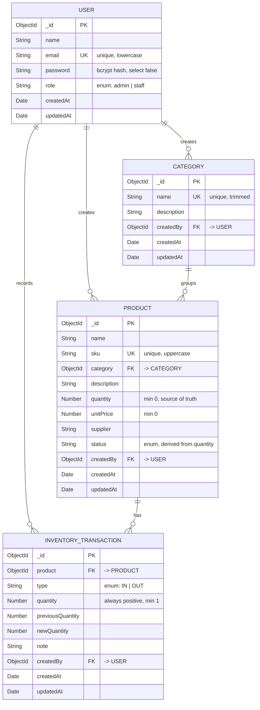

# StockFlow — Inventory Management System

A full-stack inventory management application built with the MERN stack. It lets a team track products across categories, record every stock movement with a full audit trail, and monitor stock health from a dashboard.

Built as a Junior Full Stack Developer technical assignment.

---

## Features

**Authentication**
- Register, login, logout
- JWT-based stateless authentication
- Passwords hashed with bcrypt (salt + cost factor 10)
- Protected API routes and protected frontend routes
- Role-based authorization: the first registered user becomes `admin`, everyone after is `staff`
- Only `admin` may delete products or categories
- Session survives a page refresh

**Category Management**
- Full CRUD
- Case-insensitive duplicate name prevention
- A category in use by products cannot be deleted
- Live product count per category

**Product Management**
- Full CRUD plus a dedicated product details page
- Unique SKU (normalised to uppercase)
- Every product belongs to a category
- Automatic stock status derived from quantity

**Inventory**
- Stock In / Stock Out movements
- Negative stock is rejected, never silently clamped
- Status recalculated on every quantity change
- Full audit trail: who moved what, when, and why

**Search, Filter, Sort & Pagination**
- Search by product name or SKU
- Filter by category and status
- Sort by name, price, quantity or date
- Server-side pagination

**Dashboard**
- Total products, categories, total stock, low stock, out of stock
- Recently added products
- Recent stock activity
- "Needs attention" list of low / out-of-stock items

**UI**
- Responsive (mobile drawer, scrollable tables, stacking cards)
- Light and dark theme with persistence
- Skeleton loaders, empty states, toast notifications
- Reusable component library

---

## Tech Stack

| Layer | Technology |
|---|---|
| Frontend | React 19, Vite 8, React Router 7, Context API, Axios, Tailwind CSS 4 |
| Backend | Node.js, Express 5, Mongoose 9 |
| Database | MongoDB 7 |
| Auth | jsonwebtoken, bcryptjs |
| Icons / Toasts | lucide-react, react-hot-toast |

No TypeScript, no Redux, no Next.js — plain JavaScript throughout.

---

## Prerequisites

- **Node.js** v18 or higher (developed on v20.20.0)
- **npm** v9 or higher
- **MongoDB** running locally on port 27017, or a MongoDB Atlas connection string

Check MongoDB is running:

```bash
systemctl is-active mongod     # Linux
brew services list             # macOS
```

---

## Installation

### 1. Clone the repository

```bash
git clone https://github.com/Yugal-Patil-38/Inventory-Management.git
cd Inventory-Management
```

### 2. Backend setup

```bash
cd backend
npm install
cp .env.example .env
```

Open `.env` and set a real `JWT_SECRET`. Generate one with:

```bash
node -e "console.log(require('crypto').randomBytes(32).toString('hex'))"
```

Start the API:

```bash
npm run dev      # nodemon, auto-restarts on change
# or
npm start        # plain node
```

The API runs at **http://localhost:5000**. You should see:

```
Server running on port 5000
MongoDB connected: 127.0.0.1
```

### 3. Frontend setup

Open a second terminal:

```bash
cd frontend
npm install
cp .env.example .env
npm run dev
```

The app runs at **http://localhost:5173**.

### 4. Create an account

Open http://localhost:5173, click **Create one**, and register. You will land on the dashboard.

Create a category first, then add products to it.

---

## Environment Variables

### `backend/.env`

| Variable | Description | Example |
|---|---|---|
| `PORT` | Port the API listens on | `5000` |
| `MONGO_URI` | MongoDB connection string | `mongodb://127.0.0.1:27017/inventory_db` |
| `CLIENT_URL` | Frontend origin, used for CORS | `http://localhost:5173` |
| `JWT_SECRET` | Secret used to sign tokens — keep private | *(64-char random hex)* |
| `JWT_EXPIRES_IN` | Token lifetime | `7d` |

### `frontend/.env`

| Variable | Description | Example |
|---|---|---|
| `VITE_API_URL` | Base URL of the API | `http://localhost:5000/api` |

> Vite only exposes variables prefixed with `VITE_` to the browser. Never put a secret in a `VITE_` variable — everything in the frontend bundle is public.

Use `127.0.0.1` rather than `localhost` in `MONGO_URI`. On Node 18+, `localhost` can resolve to IPv6 `::1` while `mongod` listens only on IPv4, causing `ECONNREFUSED ::1:27017`.

---

## Database Schema

### ER Diagram



### Collections

| Model | Collection | Purpose |
|---|---|---|
| `User` | `users` | Accounts and authentication |
| `Category` | `categories` | Product groupings |
| `Product` | `products` | The inventory itself |
| `InventoryTransaction` | `inventorytransactions` | Audit log of stock movements |

### Indexes

| Collection | Index | Type | Why |
|---|---|---|---|
| `users` | `email` | unique | Login lookup, prevents duplicate accounts |
| `categories` | `name` | unique | Prevents duplicate category names |
| `products` | `sku` | unique | Business key, enforces SKU uniqueness |
| `products` | `category` | single | Category filter + delete guard count |
| `products` | `status` | single | Status filter + dashboard counters |
| `inventorytransactions` | `{ product: 1, createdAt: -1 }` | compound | Serves "this product's history, newest first" from the index |

### Stock Status Rules

Status is **derived from quantity** and rewritten on every create, update and stock movement by `backend/utils/stockStatus.js`:

| Quantity | Status |
|---|---|
| `> 10` | In Stock |
| `1 – 10` | Low Stock |
| `0` | Out of Stock |

Storing it (rather than computing it on read) is what makes `?status=Low Stock` a real database query — required for server-side pagination to report correct page counts.

---

## API Documentation

Base URL: `http://localhost:5000/api`

Full request/response examples: **[docs/API.md](docs/API.md)**
Postman collection: **[docs/Inventory-Management.postman_collection.json](docs/Inventory-Management.postman_collection.json)**

### Endpoint Summary

| # | Method | Endpoint | Auth | Purpose |
|---|---|---|---|---|
| 1 | GET | `/api/health` | — | Health check |
| 2 | POST | `/api/auth/register` | — | Create account, returns token |
| 3 | POST | `/api/auth/login` | — | Log in, returns token |
| 4 | GET | `/api/auth/me` | ✅ | Current user (session rehydration) |
| 5 | POST | `/api/categories` | ✅ | Create category |
| 6 | GET | `/api/categories` | ✅ | List categories with product counts |
| 7 | GET | `/api/categories/:id` | ✅ | Get one category |
| 8 | PUT | `/api/categories/:id` | ✅ | Update category |
| 9 | DELETE | `/api/categories/:id` | 🔑 admin | Delete (blocked if in use) |
| 10 | POST | `/api/products` | ✅ | Create product |
| 11 | GET | `/api/products` | ✅ | List with search/filter/sort/pagination |
| 12 | GET | `/api/products/:id` | ✅ | Get one product (details page) |
| 13 | PUT | `/api/products/:id` | ✅ | Update product |
| 14 | DELETE | `/api/products/:id` | 🔑 admin | Delete product |
| 15 | GET | `/api/inventory` | ✅ | All stock movements, paginated |
| 16 | POST | `/api/inventory/:productId` | ✅ | Record stock in/out |
| 17 | GET | `/api/inventory/:productId` | ✅ | One product's movement history |
| 18 | GET | `/api/dashboard/stats` | ✅ | Dashboard statistics |

### Authentication and Authorization

Protected endpoints require a bearer token:

```
Authorization: Bearer <token>
```

Endpoints marked 🔑 **admin** additionally require the `admin` role. A `staff` user
calling them receives **403 Forbidden**.

| Role | Can do | Cannot do |
|---|---|---|
| `admin` | Everything | — |
| `staff` | Create/edit products and categories, move stock, view everything | Delete products or categories |

The **first user to register becomes `admin`** (they are setting the system up); every
later registration defaults to `staff`. Role is never accepted from the request body.

### Query Parameters — `GET /api/products`

| Param | Type | Default | Example |
|---|---|---|---|
| `search` | string | — | `?search=laptop` (matches name **or** SKU) |
| `category` | ObjectId | — | `?category=65f...` |
| `status` | enum | — | `?status=Low Stock` |
| `sortBy` | string | `createdAt` | `name` · `unitPrice` · `quantity` · `createdAt` |
| `order` | string | `desc` | `asc` · `desc` |
| `page` | number | `1` | `?page=2` |
| `limit` | number | `10` | `?limit=20` |

### Status Codes

| Code | Meaning |
|---|---|
| 200 | OK |
| 201 | Created |
| 400 | Validation failed / insufficient stock / malformed id |
| 401 | Missing, invalid or expired token; bad credentials |
| 403 | Authenticated, but the role is not permitted to do this |
| 404 | Resource not found |
| 409 | Duplicate resource, or category still in use |
| 500 | Unhandled server error |

All errors return the same shape, so the frontend always reads `error.response.data.message`:

```json
{ "message": "SKU already exists" }
```

---

## Project Structure

```
Inventory-Management/
│
├── backend/
│   ├── config/
│   │   └── db.js                     MongoDB connection
│   ├── controllers/
│   │   ├── authController.js         register, login, getMe
│   │   ├── categoryController.js     category CRUD
│   │   ├── productController.js      product CRUD + filtering
│   │   ├── inventoryController.js    stock movements + activity
│   │   └── dashboardController.js    aggregated statistics
│   ├── middleware/
│   │   ├── authMiddleware.js         JWT verification, sets req.user
│   │   └── errorMiddleware.js        404 + centralised error handler
│   ├── models/
│   │   ├── User.js
│   │   ├── Category.js
│   │   ├── Product.js
│   │   └── InventoryTransaction.js
│   ├── routes/
│   │   ├── authRoutes.js
│   │   ├── categoryRoutes.js
│   │   ├── productRoutes.js
│   │   ├── inventoryRoutes.js
│   │   └── dashboardRoutes.js
│   ├── utils/
│   │   ├── generateToken.js          jwt.sign wrapper
│   │   └── stockStatus.js            quantity -> status
│   ├── .env.example
│   └── server.js                     entry point
│
├── frontend/
│   ├── src/
│   │   ├── components/
│   │   │   ├── common/               Button, Input, Select, Table, Card,
│   │   │   │                         Badge, Modal, ConfirmDialog, Skeleton,
│   │   │   │                         EmptyState, Pagination, PageHeader,
│   │   │   │                         StatusBadge
│   │   │   ├── layout/               DashboardLayout, Sidebar, Navbar,
│   │   │   │                         ProtectedRoute
│   │   │   ├── dashboard/            StatCard
│   │   │   ├── products/             ProductTable, ProductFilters, StockModal
│   │   │   └── categories/           CategoryCard, CategoryForm
│   │   ├── context/
│   │   │   ├── AuthContext.jsx       user, login, register, logout
│   │   │   └── ThemeContext.jsx      light / dark theme
│   │   ├── pages/
│   │   │   ├── Login.jsx
│   │   │   ├── Register.jsx
│   │   │   ├── Dashboard.jsx
│   │   │   ├── Products.jsx
│   │   │   ├── ProductForm.jsx       handles both create and edit
│   │   │   ├── ProductDetails.jsx    read-only view + stock history
│   │   │   ├── Categories.jsx
│   │   │   ├── Inventory.jsx
│   │   │   └── NotFound.jsx
│   │   ├── services/                 axios instance + one file per resource
│   │   ├── utils/formatters.js       currency and date formatting
│   │   ├── App.jsx                   route definitions
│   │   └── main.jsx                  React entry point
│   ├── .env.example
│   └── vite.config.js
│
└── docs/
    ├── API.md
    └── Inventory-Management.postman_collection.json
```

---

## Architecture Notes

**Request lifecycle for a protected endpoint**

```
React component
  -> service (axios)
  -> request interceptor attaches "Authorization: Bearer <token>"
  -> Express: cors -> express.json() -> route
  -> protect middleware: jwt.verify -> User.findById -> req.user -> next()
  -> controller: validate -> Mongoose query -> res.status().json()
  -> errors flow to errorMiddleware, which returns { message }
```

**Why `status` is stored rather than computed** — filtering by status has to happen in the database, otherwise server-side pagination would return wrong page counts.

**Why frontend route protection is not security** — `ProtectedRoute` is UX only and can be bypassed in devtools. The real gate is `authMiddleware` on every protected route; a bypassed frontend renders an empty page because every API call still returns 401.

**Why logout has no API call** — JWTs are stateless. There is no server session to destroy, so logout clears the token client-side. The trade-off is that a leaked token stays valid until it expires.

---

## Known Limitations

These are deliberate scope decisions, not oversights:

| Limitation | Detail | How it would be fixed |
|---|---|---|
| Stock updates are not atomic | The product update and the transaction log are two separate writes | A MongoDB transaction — requires a replica set, not a standalone `mongod` |
| Search does not use an index | Unanchored `$regex` forces a collection scan | A text index, or Atlas Search, at the cost of partial-word matching |
| Token stored in `localStorage` | Readable by any JavaScript on the page, so XSS could steal it | httpOnly cookie plus CSRF protection |
| No token refresh | A leaked token is valid for its full 7 days | Short-lived access tokens plus refresh tokens |
| Category uniqueness race | The case-insensitive check is on the query, not the index | Recreate the unique index with a collation |
| Shared inventory | All logged-in users see the same data | Compound `{ createdBy, sku }` index and per-user filtering |
| Only two roles | `admin` and `staff`, with one rule (delete) | A permissions table, or a library such as CASL |
| No automated tests | Verified manually and via the Postman collection | Jest + Supertest for the API, React Testing Library for the UI |

---

## Future Improvements

- Granular permissions beyond admin/staff
- Product image upload
- CSV import and export
- Low-stock email alerts
- Stock movement charts over time
- Multi-warehouse support

---

## Scripts

**Backend**

| Command | Description |
|---|---|
| `npm run dev` | Start with nodemon (auto-restart) |
| `npm start` | Start with plain node |

**Frontend**

| Command | Description |
|---|---|
| `npm run dev` | Start the Vite dev server |
| `npm run build` | Production build into `dist/` |
| `npm run preview` | Preview the production build |

---

## Troubleshooting

| Problem | Cause | Fix |
|---|---|---|
| `MongoDB connection failed` | `mongod` not running | `sudo systemctl start mongod` |
| `ECONNREFUSED ::1:27017` | IPv6 resolution | Use `127.0.0.1` instead of `localhost` in `MONGO_URI` |
| `secretOrPrivateKey must have a value` | `JWT_SECRET` missing | Set it in `backend/.env` |
| CORS error in the browser | `CLIENT_URL` mismatch | Set it to the exact frontend origin |
| Requests return 401 after a while | Token expired | Log in again |
| Two identical requests in the Network tab | React StrictMode double-mounts in development | Expected; does not happen in production builds |
